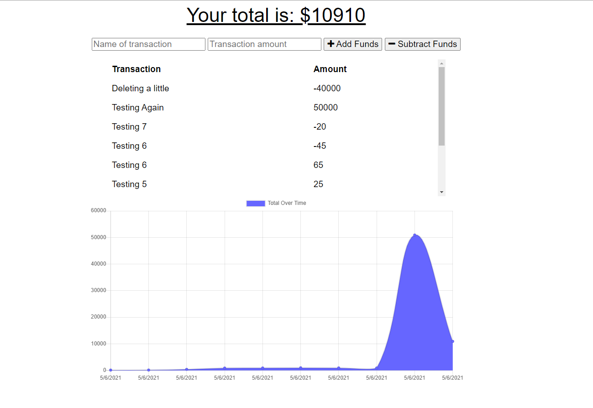

# Progressive_Budget
homework 18

    
## Description

Progressive Budget tracker is a progressive web application that allows the user to record transactions while online using MongoDB or offline using indexedDB. Transaction data recorded offline will sync with the online database as soon as a network connection is re-established.
      
## Table of Contents
1. [Install Instructions](#install-instructions)
2. [Usage Instructions](#usage-instructions)
3. [License](#license)
4. [Contribution Guidelines](#contribution-guidelines)
5. [Test Instructions](#test-instructions)
6. [Questions](#questions)

## Install Instructions

Navigate to (https://glacial-garden-61716.herokuapp.com/)
  
## Usage Instructions

Enter your transaction, the transaction amount, choose whether the transaction was an addition or subtraction from your account. If you loose the network connection while using the application, don't fret, you can continue using the app and record your transactions. When a network connection is re-establishd, the data will sync with the online database.

## Screenshot

## License
  
This application is licensed under MIT License.
     

    

## Contribution Guidelines

Contributions are welcome.

## Test Instructions

There are no tests yet.

## Questions

If you have any questions, contact the author:  

GitHub [@lpaschka37](https://github.com/lpaschka37)  
Email [lpaschka37@gmailcom](mailto:lpaschka37@gmail.com)